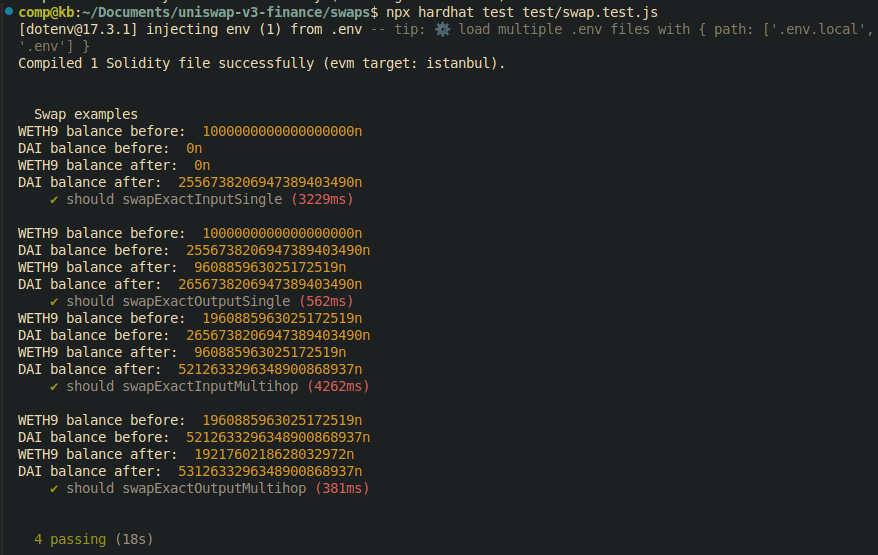

# UniswapV3 token swaps, Singlehop swap and Multihop swaps

This project demonstrates the token swap functionality.

## SingleHopSwap:

Swaps the token A for token B directly from the pool A/B.

There are two ways using which the user can swap tokens using singlehop:

**1. swapExactInputSignle:**
swaps the fixed amount of token A and get maximum possible amount of token B.

> example: If 1 ETH = 100 DAI, if user deposits 1 ETH, he gets 100 DAI in return.

**2. swapExactOutputSingle:**
tries to swap minimum amount of token A that user gives, to get the exact amount of token B specified by the user.

> example: If 1ETH = 100 DAI, user specifies he wants 20 DAI, he deposits 1 ETH, the function will accept 0.2 ETH and refund rest back to user with 20 DAI.

## Multihop:

-   Multihop: Insted of swapping from token A to token B, we can swap from token A to token C through token B.
-   This is called a multihop swap and can be done with `exactInput` and `exactOutput` in the swap router.
-   Purpose of multihopSwap: In some cases, there may not be a direct pool between the token you want to swap from and the token you want to swap to, or the direct pool may not have enough liquidity.
-   In these cases, you can use a multihop swap to route through an intermediate token that has pools with both the input and output tokens. This can help you achieve better prices and access more liquidity.

Try running some of the following tasks:

```shell
npm i
```

```shell
npx hardhat compile
```

```shell
npx hardhat test test/swap.test.js
```

## Hardhat test result


